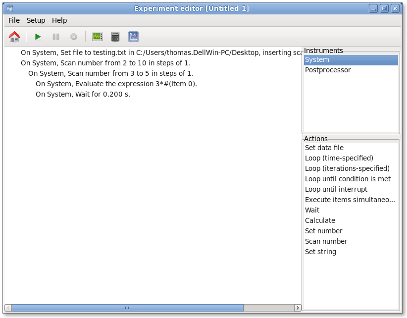

====================
Project organization
====================

The main software directory is called ``Transport``, and this name is **very important**, since the code refers this name to turn relative paths into 
absolute paths. From here on out, all paths will be specified relative to this directory.

   This is a random figure

